# Tutorial Lido2Mapsme+ et Lido2Gramet+ #

***À quoi sert ce tuto ?***

1.  À simplifier l’export des routes OFP vers mPilot et vers Maps.me, le tout sans avoir besoin de connexion internet. Seul l’OFP en pdf est nécessaire.

2.  À récupérer les informations météo Gramet et Sigmet (connexion internet requise)

*Suivez le [*groupe Yammer Maps.me*](https://www.yammer.com/airfranceklm.com/#/threads/inGroup?type=in_group&feedId=5475890) pour les updates.*

## Démarrage et installation ##

Trois applications sont nécessaires :

-   [*Maps.me*](https://itunes.apple.com/us/app/maps.me-offline-map-routing/id510623322?mt=8) (gratuit)

-   [*Workflow*](https://itunes.apple.com/fr/app/workflow-powerful-automation/id915249334?mt=8) (payant)

-   [*Editorial*](https://itunes.apple.com/fr/app/editorial/id673907758?mt=8) (payant)

Voici les liens vers les différents scripts (ou *workflow*) nécessaires :

-   workflows pour l'application Editorial :

    -   [*route OFP -&gt; mPilot et Maps.me*](http://www.editorial-workflows.com/workflow/5800601703153664/o7BioyJJW8o)

    -   [*Ogimet / Sigmet -&gt; Maps.me*](http://www.editorial-workflows.com/workflow/5833750260744192/T_q3eg1pbg8)

-   workflows pour l'application WORKFLOW :

    -   [*route OFP -&gt; mPilot et Maps.me*](https://workflow.is/workflows/7c3c1b94382f4f5a9d67b13fbebe0e53)

    -   [*Ogimet / Sigmet -&gt; Maps.me*](https://workflow.is/workflows/89ed5ead31e440439681c3d96845933f)

    -   [*Revoir Ogimet*](https://workflow.is/workflows/4d4dc41212734e32aa0ac07a7b3deb2e)

    -   

Pour utiliser ces liens, ouvrez-les sur l’iPad où vous disposez des applications WORKFLOW et Editorial. Si jamais les liens ne fonctionnent pas correctement, ouvrez ce fichier pdf dans iBooks (icône exporter qui a cette forme-là en général ).

## Lancement des Workflows ##

Il faut obtenir le pdf du dossier de vol sur son iPad (celui reçu dans Mail ou PilotMission par exemple, ou bien encore en le récupérant sur [*http://s4a.airfrance.fr*](http://s4a.airfrance.fr)).

Une fois qu'on l'a ouvert, faire "Exporter"  puis choisir "Run Workflow" et choisir le workflow désiré selon ce que l'on veut utiliser (les différents workflows sont expliqués plus loin dans ce document).

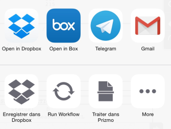
Si jamais vous n’avez pas l’icône "Run Workflow", deux possibilités : vous n’avez pas installé l’application… ou bien il faut activer son affichage via le bouton More, on tombe alors sur la fenêtre suivante :

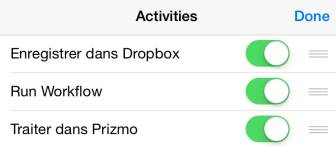

Il faut activer l’interrupteur situé en face de Run Workflow pour que l’option soit apparente dans la fenêtre précédente.

*Astuce : dans ce popup qui s’ouvre, vous pouvez classer les applications dans l’ordre que vous souhaitez en appuyant longtemps dessus*

On arrive alors au choix des workflows :

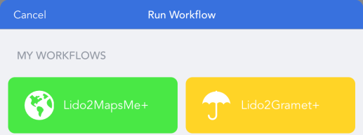

Les chapitres suivants détaillent leurs fonctionnalités et leur utilisation.

## Workflow Lido2Mapsme+ ##

### Finalité du workflow ###

Ce script ne nécessite pas de connexion internet sauf pour son premier lancement et lors des mises à jour), il doit être lancé depuis la fonction exporter  du pdf de l’OFP et réalise les choses suivantes :

-   il récupère la route entière (même sur un track) et le dégagement

-   il place la route entière sans dégagement dans le presse-papier afin de pouvoir faire « coller » (ou « Paste ») dans l’application LIDO mPilot

-   il crée un fichier KML qui va pouvoir être ouvert dans Maps.me. Ce fichier contient la route et le dégagement, les tracks dans le cas d’une traversée océanique et l’orthodromie du vol. Ce fichier KML est personnalisable, on en reparle [*plus loin*](#personnaliser-son-fichier-kml).

### Utilisation du workflow ###

Après le lancement du script, il va y avoir un ballet entre les applications WORKFLOW et Editorial. À la première utilisation ou lors d’une mise à jour des workflows, Editorial va télécharger les données nécessaires (internet requis pour cela, mais une fois téléchargées, les données sont utilisables hors ligne) et affichera une bulle vous informant que l’opération a été effectuée :

À un moment donné, une autre bulle vous informera que la route OFP a été copiée dans le clipboard (presse-papier) :

Vous n’aurez plus qu’à la coller dans la partie Load Route de LIDO mPilot.

Une fois le workflow terminé, une fenêtre s'afffiche proposant d'ouvrir le fichier KML avec l'application de son choix. On choisit Maps.me bien entendu :

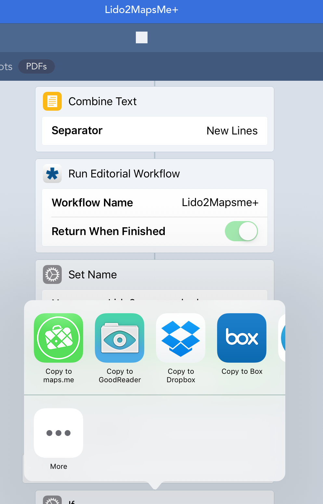

*Astuce : dans ce popup qui s’ouvre, vous pouvez classer les applications dans l’ordre que vous souhaitez en appuyant longtemps dessus*

### Personnaliser son fichier KML ###

Par défaut des couleurs ont été choisies pour les épingles, et le KML affiche un certain nombre d’éléments (route OFP, dégagement, NAT, orthodromie).

Vous pouvez modifier tout cela. Ouvrez l’application Editorial, puis appuyez sur la clé à molette en haut à droite :

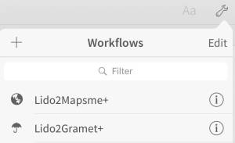

Appuyez ensuite sur le petit  « i » en face du workflow Lido2Mapsme+,

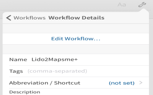

puis sur « Edit Workflow… »

Vous aurez alors accès aux entrailles du workflow. Répérez l’étape verte et appuyez dessus :

Vous avez alors accès aux réglages, un petit texte vous expliquant la finalité de chacun et comment le modifier :

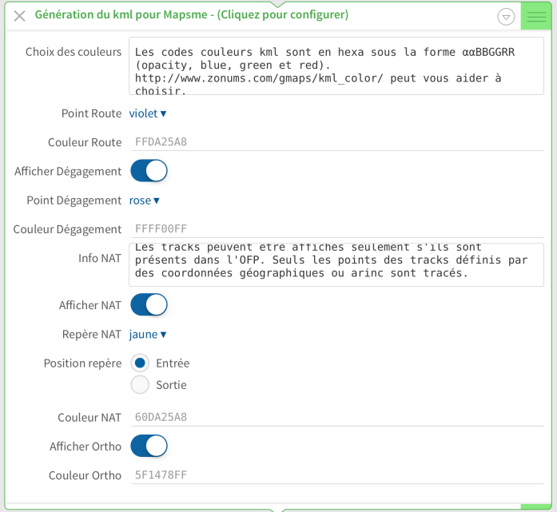

Validez en appuyant sur Done en haut à droite :

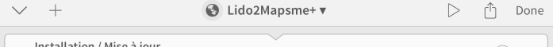

## Workflow Lido2Gramet+ ##

### Finalité du workflow ###

Ce script nécessite d’être connecté à internet, il doit être lancé depuis la fonction exporter  du pdf de l’OFP et réalise les choses suivantes :

-   il récupère les informations de route de l’OFP afin de construire une route compatible avec [*le site Ogimet*](http://ogimet.com/gramet_aero.phtml.en), il crée un fichier KML avec cette route approchée pour que vous puissiez la comparer à la route de l’OFP

-   il récupère l’heure de bloc prévu pour synchroniser Ogimet

*Note : si utilisation avec un ancien OFP, il utilise l’heure courante*

-   il récupère le fichier image du gramet et le stocke dans un répertoire de votre pellicule photo

-   il récupère les Sigmets valides à l’instant t et il ajoute au fichier KML contenant la route Ogimet (celui du premier point de cette liste) les zones dessinées des Sigmets avec leurs descriptions.

### Utilisation du workflow ###

Il faut d’abord créer un répertoire spécifique dans l’application Photos de l’iPad. Pour ce faire, ouvrez cette application, appuyez sur Albums (en bas dans le menu) :

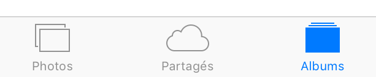

puis sur « + » en haut à gauche :

Un popup s’ouvre vous demandant de nommer le nouvel album. Nommez-le « Gramet », puis faites enregistrer.

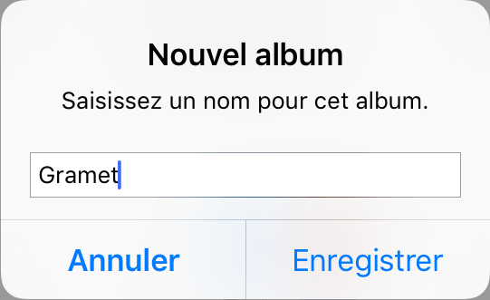

La fenêtre Moments s’ouvre, fermez-la en appuyant sur OK en haut à droite.

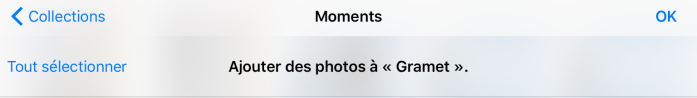

Vous constatez que votre nouvel album Gramet a été ajouté dans la liste des albums.

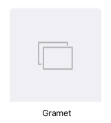

Après le lancement du script, il va y avoir un ballet entre les applications WORKFLOW et Editorial de la même manière qu’avec le script Lido2Mapsme+.

Une fois les actions terminées, on vous propose d’ouvrir le fichier KML avec l’application de votre choix :

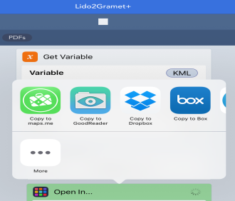

Ce fichier KML ouvert dans Maps.me contient les zones de Sigmet.

Le workflow a également copié le fichier image Ogimet dans le répertoire Gramet de l’application Photos. Vous pouvez y accéder en ouvrant l’application Photos et en allant dans l’album Gramet, ou alors on peut configurer un petit raccourci, c’est l’objet du paragraphe [*Workflow Revoir GRAMET*](#finalité-du-workflow).

### Personnaliser son fichier KML ###

Par défaut des couleurs ont été choisies pour les épingles Sigmet, et le KML affiche un certain nombre d’éléments (route Ogimet, Sigmets).

Vous pouvez modifier tout cela. Ouvrez l’application Editorial, puis appuyez sur la clé à molette en haut à droite :

Appuyez ensuite sur le petit « i » en face du workflow Lido2Gramet+, puis sur Edit Workflow…

Vous aurez alors accès aux entrailles du workflow. Repérez l’étape verte et appuyez dessus :

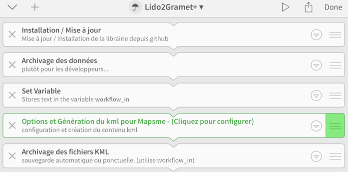

Vous avez alors accès aux réglages, un petit texte vous expliquant la finalité de chacun et comment le modifier :

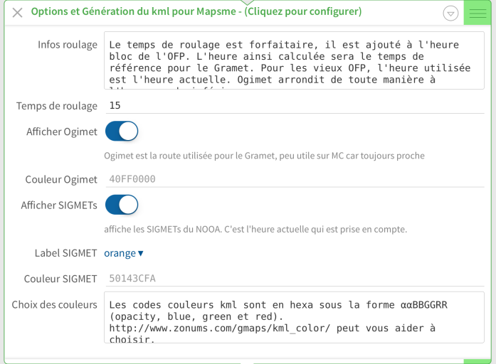

Validez en appuyant sur Done en haut à droite :

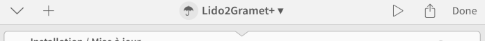

## Workflow Revoir GRAMET ##

### Finalité du workflow ###

Créer un raccourci pour consulter rapidement le Gramet que l’on a téléchargé avant le vol.

### Utilisation du workflow ###

Pour commencer, rendez-vous dans l’application WORKFLOW, puis appuyez sur le workflow « Revoir GRAMET »

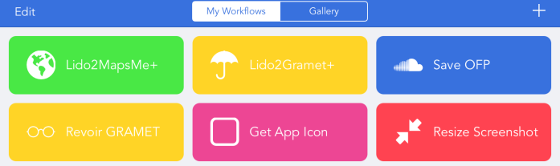

Ensuite, il faut s’assurer que le workflow connaît l’album Gramet que l’on a créé précédemment. Sur la deuxième ligne du workflow, on lit « Album is All Photos »

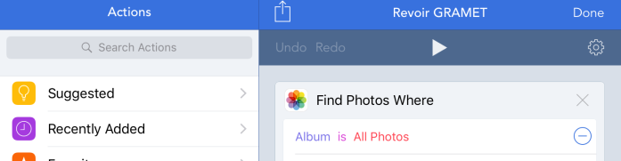

On touche cette ligne, ce qui fait apparaître un popup dans lequel on peut sélectionner notre album Gramet :

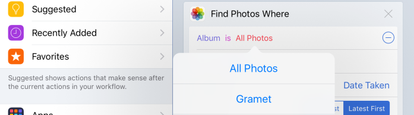

Enfin on ferme le workflow modifié avec le bouton Done en haut à droite

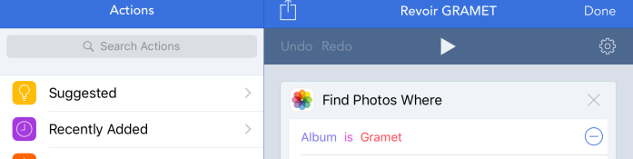

On va maintenant créer le raccourci proprement dit.

Pour cela, ouvrez le centre de notification… le centre de quoi ?? Avec votre doigt, balayez vers le bas depuis le haut de l’écran. Commencez le balayage depuis la caméra au-dessus de l’écran vers le bas. Le centre de notification descend depuis le haut de l’écran, sélectionnez Aujourd’hui puis Modifier en bas:

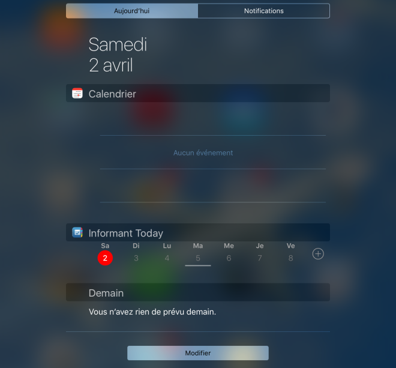

Ensuite, cherchez dans la liste l’application WORKFLOW et appuyez sur le + situé à côté d’elle :

puis validez en appuyant sur OK en haut à droite

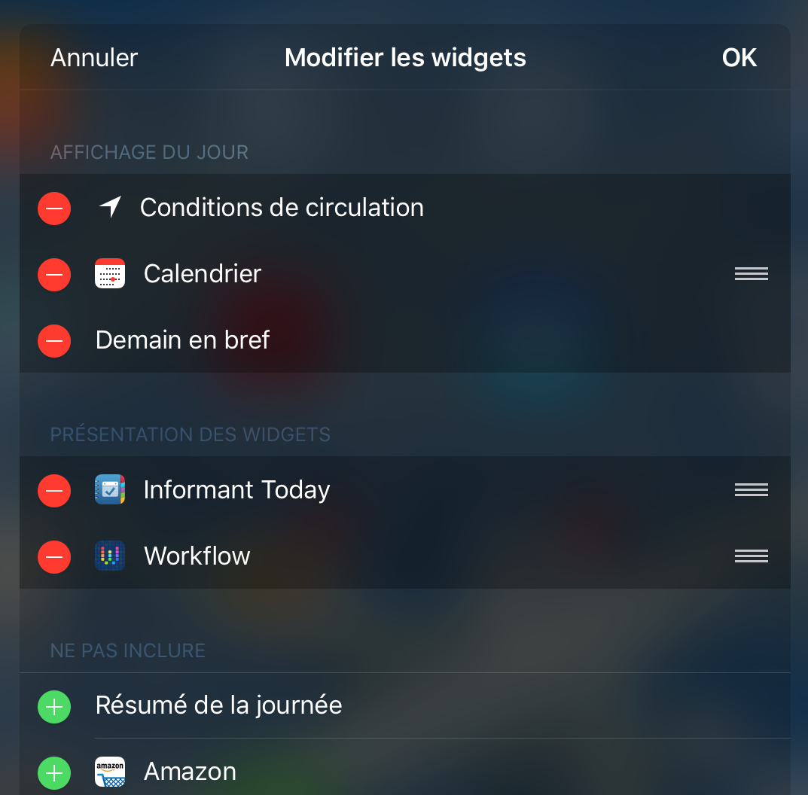

Vous obtenez alors dans le centre de notifications des raccourcis vers certains workflows. Vous pouvez choisir lesquels afficher en appuyant sur Manage workflows

Vous pouvez alors sélectionner les workflows à afficher dans le centre de notifications. Par exemple, sélectionner uniquement « Revoir GRAMET ».

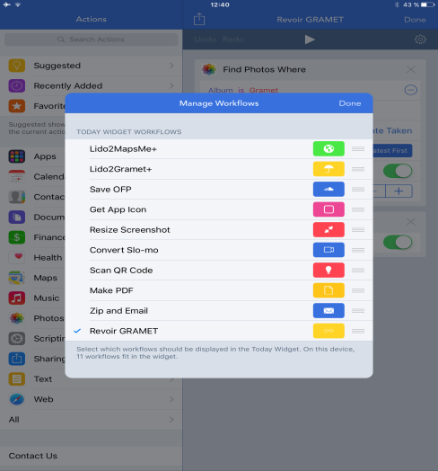

Vous pouvez maintenant revoir le dernier Gramet enregistré en deux actions via le centre de notifications !

## Application Maps.me ##

Enfin, l'application Maps.me n'est intéressante que si on l'enrichit de fichiers kml avec les terrains qui nous intéressent. Ces fichiers kml sont regroupés dans le répertoire suivant :

[*https://app.box.com/s/0dep0t1fqkpq2kkpvcgc64po29pep8k7*](https://app.box.com/s/0dep0t1fqkpq2kkpvcgc64po29pep8k7) .

On le trouve également dans la doc partagée : Doc optionnelle / Divers / Airports Olivier Ravet.

Dans ce répertoire, le fichier ReadMeFirst.pdf explique les différents fichiers disponibles. Il faut ouvrir ceux que l'on veut avoir dans Maps.me, par exemple depuis l'application Box.

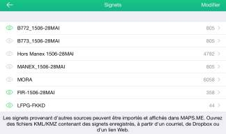

On choisit les fichiers à afficher via l’étoile située en bas de l’écran.

Ci-dessous une illustration de ce que l’on peut voir dans Maps.me. Chaque « pin » présente ensuite le détail du terrain (informations pistes, MSA, fréquence moyens radio, ATC)

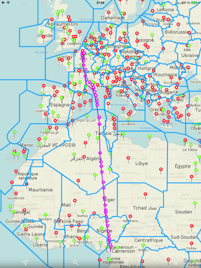

Fichier base avion (ici 773)

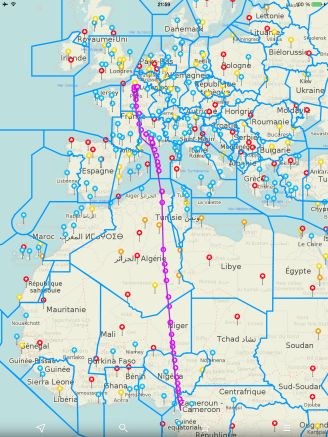

Fichier terrains MANEX

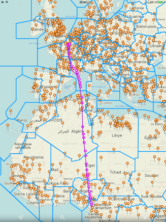

Fichier terrains hors MANEX

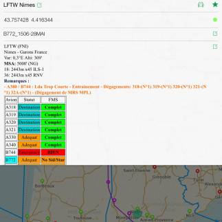

Pop-up détail terrain (Utiliser **deux doigts** pour *zoomer* ou pour faire *défiler* le contenu)
